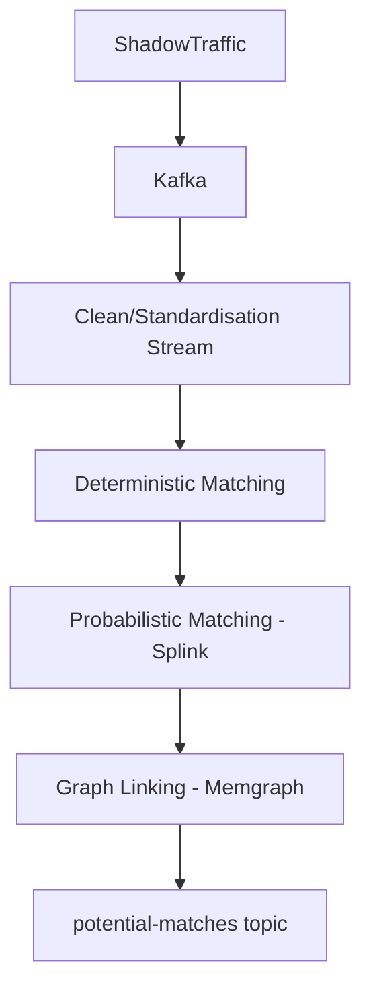

# Customer Entity Resolution (CER) Proof-of-Concept

This project demonstrates a **real-time entity resolution pipeline** for a hypothetical enterprise org. 

It combines **Kafka**, **Splink**, **Memgraph**, and **ShadowTraffic** to identify when records from multiple systems of record (SoRs) refer to the same entity.

---

## Architecture Overview

1. **Ingestion:** ShadowTraffic publishes synthetic customer records from multiple SoRs to Kafka topics. - Work in progress, requires license. 
2. **Standardisation:** Cleans, normalises and enriches data into source system topic, for fan-in to canonical `staged.customer` topic. I am using metaphones here for forename/surname, to improve splink record linking performance. We also produce blocking rules / keys here for match reduction technique.
3. **Deterministic matching:** Exact rules (e.g., National ID + DOB) create `match.deterministic` events.  
4. **Probabilistic matching:** [Splink](https://moj-analytical-services.github.io/splink/index.html) applies Fellegi-Sunter scoring to create `match.probabilistic` events. Will use probability scores out of splink to populate weights of edges/nodes in graph.
5. **Graph resolution:** Memgraph merges deterministic and probabilistic links into connected components. Using a combination of Jaccard, pairwise similarity
6. **Output:** When all phases complete, a `potential-matches` event is emitted for review or merge.

---

## Stack

| Component | Purpose |
|------------|----------|
| **Kafka** | Event backbone |
| **Schema Registry** | Avro schema contracts for all topics |
| **ShadowTraffic** | Synthetic SoR data generator |
| **Kafka-UI** | Browser UI to inspect topics and schemas |
| **Splink (DuckDB)** | Probabilistic record linkage |
| **Memgraph + MAGE** | Graph-based entity resolution and community detection |

---

## Synthetic Data Generation

The generator at generators/customers.json defines:

Multiple SoRs (CRM, Billing, Claims)

Controlled duplication, nicknames, typos, address changes

Cross-system linkages for realistic entity resolution tests

You can tune the realism by editing the globals section:

"duplicationRate": 0.18,
"familyPolicyRate": 0.35,
"diffSurnameInFamilyRate": 0.22

