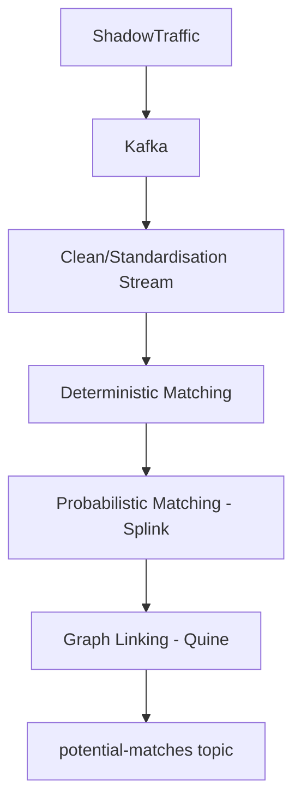

# Customer Entity Resolution (CER) Proof-of-Concept

This project demonstrates a **real-time entity resolution pipeline** for a hypothetical enterprise org. 

It combines **Kafka**, **Splink**, **Quine**, and **ShadowTraffic** to identify when records from multiple systems of record (SoRs) refer to the same entity.

---

## Architecture Overview

1. **Ingestion:** ShadowTraffic publishes synthetic customer records from multiple SoRs to Kafka topics. - Work in progress, requires license. 
2. **Standardisation:** Cleans, normalises and enriches data into source system topic, for fan-in to canonical `staged.customer` topic. I am using metaphones here for forename/surname, to improve splink record linking performance. We also produce blocking rules / keys here for match reduction technique.
3. **Deterministic matching:** Exact rules (e.g., National ID + DOB) create `match.deterministic` events. These events have a first order check based on explicit match rules, if no match is found the event node is created with an edge to a new master node record.
4. **Pair Wise matching** We define potential match candidates BETWEEN master <-> master node records. These candidates are fired to Kafka topic. 
4. **Probabilistic matching:** [Splink](https://moj-analytical-services.github.io/splink/index.html) applies Fellegi-Sunter scoring to create `match.probabilistic` events. Will then use probability scores out of splink to populate weights of edges/nodes in graph.
5. **Graph resolution:** Memgraph merges deterministic and probabilistic links into connected components. Using a combination of Jaccard, pairwise similarity other GDS methods TBD. 
6. **Output:** When all phases complete, a `potential-matches` event is emitted for review or merge. TBD - Three states occur based on merge logic weights, match above (merge masters), match positive (emit silent resolution event for customer WITH identity to confirm their records, details confirm increases weight and loop)
7. **Future** GraphSage for unsupervised GNN on ingestion

---

## Stack

| Component | Purpose |
|------------|----------|
| **Kafka** | Event backbone |
| **Schema Registry** | Avro schema contracts for all topics |
| **ShadowTraffic** | Synthetic SoR data generator |
| **Kafka-UI** | Browser UI to inspect topics and schemas |
| **Splink (DuckDB)** | Probabilistic record linkage |
| **Quine + SageMAGE** | Graph-based entity resolution and community detection |

---

## Synthetic Data Generation

https://shadowtraffic.io/

