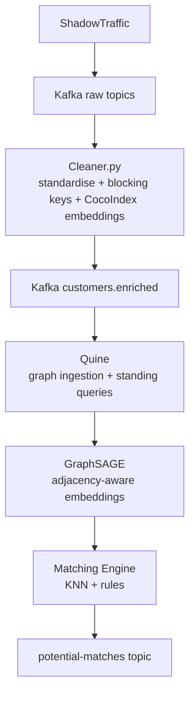

# Customer Entity Resolution (CER) — Proof-of-Concept

This project demonstrates a **real-time, graph-native entity resolution pipeline** using:

- **Kafka** for streaming ingestion  
- **Cleaner.py** for standardisation, blocking keys, metaphones  
- **CocoIndex** for high-quality semantic embeddings  
- **Quine** for real-time graph construction  
- **GraphSAGE** for neighbourhood-aware learned embeddings  
- **pgvector** for fast vector similarity search  
- **ShadowTraffic** for synthetic multi-system customer data  

The goal is to identify when multiple systems refer to the **same underlying customer**, even with data inconsistencies, typos, missing fields, or incremental updates.

Quine does not natively support GraphSage, or cosine similarity so we use pgvector for vector similarity search and export the similarity scores via ingest recipe to create edge + canonical node.

---

## Architecture Overview

# Pipeline Breakdown

## **1. Ingestion (ShadowTraffic → Kafka)**  
ShadowTraffic publishes synthetic customer events from multiple SoRs.  
*(Optional for PoC; requires a licence.)*

---

## **2. Standardisation & Enrichment (`Cleaner.py`)**

The cleaner service:

- normalises raw attributes  
- computes metaphones for name fields
- computes nicknames for name fields  
- derives a rich set of **blocking keys** for candidate pruning  
- generates **CocoIndex embeddings** for:  
  - name  
  - email  
  - phone  
  - address  
  - signature (identity-related composite)  
- publishes enriched records to the `customers.enriched` topic  

These features provide both **deterministic** and **semantic** signals for downstream entity resolution.

---

## **3. Graph Construction (Quine)**

Quine consumes enriched records and builds a **real-time identity graph**:

- Each customer → **node**  
- Blocking-key matches → **edges**  
- Similarity-based connections (email, phone, postcode, etc.)  
- Deterministic matches is 100% based on composite key, if no match is found an event node is created with edge to new customer node

Standing queries update graph structure continuously as new events arrive, and output graph structure for GraphSage embedding generation.

---

## **4. GraphSAGE Embedding Generation**

GraphSAGE produces **adjacency-aware identity embeddings** by combining:

- CocoIndex semantic embeddings  
- Graph topology derived from blocking-key edges  
- Multi-hop neighbourhood context  

These embeddings outperform rules or standalone string similarity models because they encode **structural identity signals**.

---

## **5. Matching Engine (Rules + KNN)**

The matching engine uses:

- Cosine similarity (e.g., via pgvector)  
- GraphSAGE latent embeddings  
- Blocking key overlap  
- Deterministic constraints  
- Weighted graph context  

Matches fall into three categories:

1. **Automatic merge** (above threshold)  
2. **Potential match** (sent to `potential-matches` topic)  
3. **No match**

---

## **6. Output (`potential-matches` Topic)**

Downstream consumers can subscribe to, in this case another Quine Ingest recipe to create edges and canonical nodes.

Each message contains:

- entity pair  
- similarity metrics  
- embedding distances  
- blocking keys matched  
- explanation features (planned)  

---

## **7. Silent Resolution

TBD - Probably webhook for twilio to send SMS to customer to invite to confirm THEIR details, then update graph with new information and loop - If resolution weight is above threshold then merge nodes, otherwise treat as distinct customer.

---

# Technology Stack

| Component | Purpose |
|----------|---------|
| **Kafka** | Real-time event streaming backbone |
| **Schema Registry** | Schema contracts for Kafka topics |
| **Cleaner.py** | Normalisation, metaphones, blocking keys, embeddings |
| **CocoIndex** | Text cleaning + semantic embedding generation |
| **Quine** | Real-time graph ETL + standing queries |
| **GraphSAGE** | Learned identity embeddings (graph + feature fusion) |
| **pgvector (optional)** | ANN vector search over embeddings |
| **ShadowTraffic** | Synthetic multi-SoR data generator |

---

# Synthetic Data

Synthetic test data generated using ShadowTraffic:  
🔗 https://shadowtraffic.io/

Useful for exercising realistic customer identity scenarios such as:

- Name variations  
- Email drift  
- Address changes  
- Duplicate registrations  
- Partial/dirty data  

---

# Summary

This PoC implements a **modern, ML-ready entity resolution architecture** that blends:

- semantic embeddings  
- blocking strategies  
- graph topology  
- GNN-based learned similarity  

It supports both deterministic and probabilistic matching and provides a clear pathway toward an adaptive, continuously-learning ER system.

### **Future Enhancements**

- Full GraphSAGE training pipeline  
- Online learning via human-in-the-loop resolved matches  
- Custom embedding models (via Ollama)  
- Weighting strategies for automated merge/no-merge logic  

---
